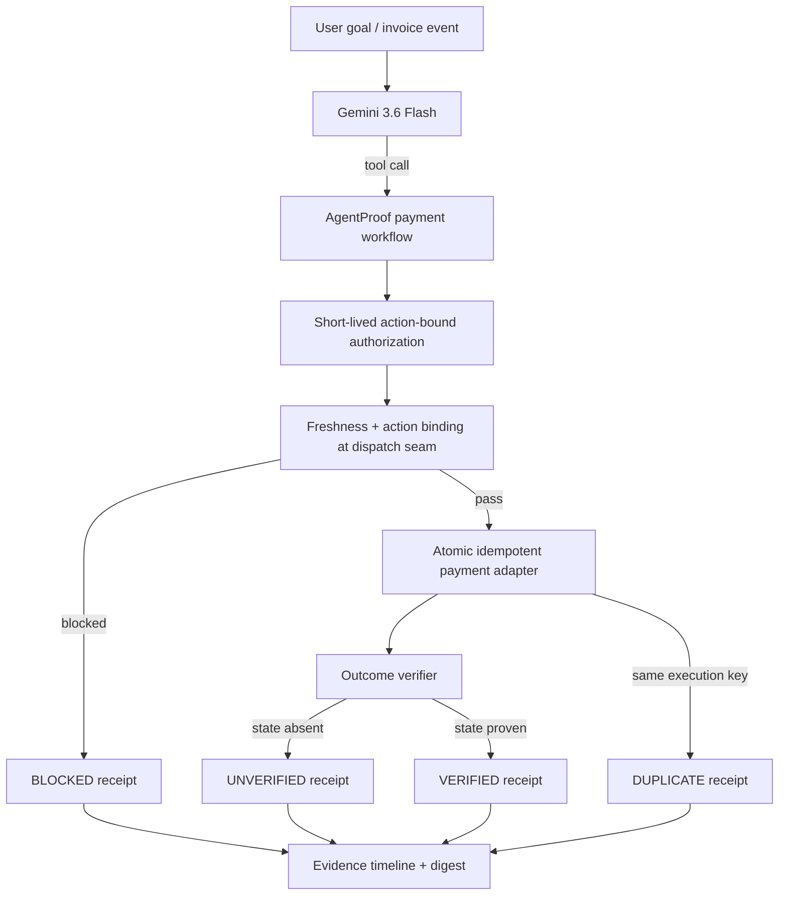

# AgentProof

> **Don't trust what an AI agent says it did. Prove what actually happened.**

## Problem

Autonomous AI agents are moving from conversation into execution — but an agent that *plans* an action correctly can still *execute* it wrongly. Four failure classes are invisible to ordinary agent frameworks and to the LLM itself:

1. **Stale authorization** — policy changes after planning but before execution.
2. **Action drift** — the action is mutated after authorization.
3. **False success** — an external API accepts a request, but the expected real-world state transition never occurs.
4. **Replay / duplicate execution** — the same action is dispatched again, including concurrent retries.

## Solution

AgentProof lets an agent act autonomously while independently proving:

- the action was authorized,
- the authorization was still fresh at the execution seam,
- the executed action matched the authorized action,
- the real-world state transition actually occurred (API acceptance ≠ business outcome),
- retries could not execute the same operation twice.

The hackathon demo uses a **simulated $50,000 vendor payment** to prove these failure classes. No real funds are moved by this repository.

## The core idea

```text
intent -> plan -> authorize -> REVALIDATE AT EXECUTION -> dispatch -> VERIFY OUTCOME -> receipt
```

Gemini may decide *what tool to call*, but it does **not** own the final truth of whether the action succeeded. AgentProof only emits `VERIFIED` after deterministic checks observe the expected state transition.

## Winning demo

| Scenario | Expected verdict | Money moved |
|---|---|---:|
| Happy path | `VERIFIED` | $50,000 |
| Vendor frozen after authorization | `BLOCKED` | $0 |
| Provider accepted, ledger unchanged | `UNVERIFIED` | $0 |
| Replay same execution key | `DUPLICATE` | still only $50,000 once |
| 24 concurrent retries | 1 `VERIFIED`, 23 `DUPLICATE` | exactly $50,000 once |

Every result includes a canonical SHA-256 evidence digest so receipt mutation is detectable when checked against the original digest.

## Architecture



## Tech

- Python 3.11+
- FastAPI
- Gemini 3.6 Flash
- Google Agent Development Kit (ADK)
- Google Gen AI SDK (`google-genai`)
- Cloud Run-ready Docker container
- Pydantic
- pytest
- deterministic state-transition verification
- atomic idempotency protection

The ADK entrypoint is `app/agent.py`. The direct Gemini goal endpoint is implemented in `app/gemini_gateway.py`. The business-critical verification core remains deterministic and testable without an LLM.

## Demo instructions

The four deterministic scenarios are available from the web UI without Gemini credentials. The full walkthrough is in [`docs/demo-script.md`](docs/demo-script.md).

## Demo links

- [Demo video on YouTube](https://youtu.be/Ey5s2v0jLO8)
- [Live Cloud Run demo](https://agentproof-ssejdi5rra-uc.a.run.app)

## Verification results

Verified on commit `f7c0ce7e1d6906518c4d027cd9f5aeabf860c28f`:

| Check | Result |
|---|---|
| Deterministic test suite | `10 passed` |
| Python compile check | `PASS` |
| GitHub Actions | [`verify` run #19](https://github.com/safal207/safal207-AgentProof-AI/actions/runs/32347099109) — `PASS` on Python 3.11 and 3.12 |
| Runtime scenarios | `VERIFIED`, `BLOCKED`, `UNVERIFIED`, `DUPLICATE` |

---

## Setup and reproducible testing

## 1. Clone and enter the project

```bash
git clone https://github.com/safal207/safal207-AgentProof-AI.git
cd safal207-AgentProof-AI
```

## 2. Create a virtual environment

```bash
python -m venv .venv
```

Activate it:

```bash
# Linux/macOS
source .venv/bin/activate

# Windows PowerShell
.venv\Scripts\Activate.ps1
```

## 3. Install dependencies

For the deterministic core and tests:

```bash
python -m pip install --upgrade pip
pip install -e '.[dev]'
```

For Gemini/ADK + Cloud deployment dependencies:

```bash
pip install -r requirements.txt
```

## 4. Run the verification suite

```bash
pytest -q
```

Expected current result:

```text
10 passed
```

The suite proves:

- real state transition is required before `VERIFIED`;
- stale authority is blocked at the execution seam;
- post-authorization action mutation is blocked;
- accepted-but-unsettled dispatch cannot become success;
- duplicate payment cannot execute twice;
- 24 concurrent retries still produce exactly one payment;
- receipt mutation changes the integrity digest.

## 5. Run the visual demo

```bash
uvicorn app.main:app --reload
```

Open:

```text
http://127.0.0.1:8000
```

The four deterministic demo buttons work without Gemini credentials.

## 6. Enable the live Gemini goal box

Copy the environment template:

```bash
cp .env.example .env
```

Set a Gemini key in your shell:

```bash
export GEMINI_API_KEY="..."
```

Optional model override:

```bash
export AGENTPROOF_GEMINI_MODEL="gemini-3.6-flash"
```

Restart the FastAPI service and use **Run with Gemini**. Gemini chooses the AgentProof tool scenario from a natural-language goal; the returned receipt remains authoritative.

You can also use Vertex AI authentication by configuring Application Default Credentials and setting:

```bash
export GOOGLE_GENAI_USE_VERTEXAI=true
```

## 7. Run through Google ADK

`app/agent.py` exposes the same payment workflow as an ADK tool and uses `gemini-3.6-flash`.

```bash
uvx google-agents-cli setup
agents-cli install
agents-cli playground
```

Configure Gemini API or Vertex AI credentials according to your environment, then ask the agent to demonstrate a normal, stale, false-success, or replay payment workflow.

## 8. Docker verification

```bash
docker build -t agentproof .
docker run --rm -p 8080:8080 -e GEMINI_API_KEY="$GEMINI_API_KEY" agentproof
```

Open `http://127.0.0.1:8080`.

## 9. Deploy to Google Cloud Run

After `gcloud` authentication and project selection:

```bash
gcloud run deploy agentproof \
  --source . \
  --region europe-north1 \
  --allow-unauthenticated
```

For the hackathon demo, use only non-sensitive simulated data. Put real credentials in Secret Manager rather than committing them to the repository.

